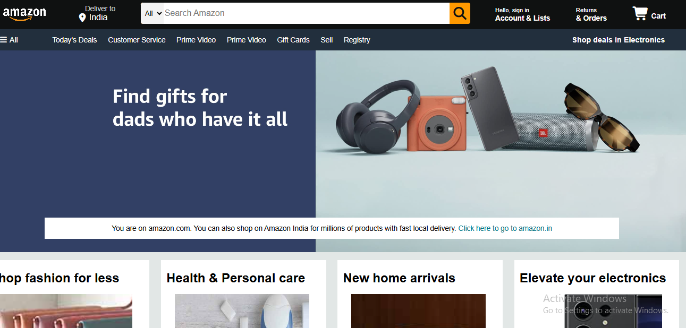

# Amazon-clone-html-css
A front-end clone of the Amazon homepage, built to practice and showcase HTML and CSS skills — including layout, responsive design, and UI replication of a real-world e-commerce site.

📸 Screenshot

